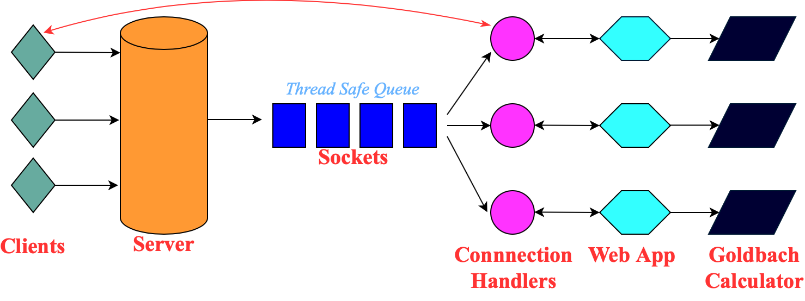

# Servidor Goldbach

## Tabla de Contenidos
  - [Información básica](#información-básica)
  - [Diagrama de funcionamiento](#diagrama-de-funcionamiento)
  - [Manual de usuario](#user_manual)
## Información básica
Este es un **servidor concurrente que pueda generar soluciones a varios clientes para las sumas de goldbach**, para ello son necesarias principalmente dos cosas: un servidor concurrente capaz de manejar varios clientes al mismo tiempo, esto porque de lo contrario tendriamos un servidor que solo puede atender a un solo cliente a la vez, y una aplicacion web que no abuse de los recursos disponibles de la computadora.

Los dos puntos anteriores corresponden respectivamente a los dos avances de los entregables del proyecto, el codigo que se nos fue provisto podia atender a un solo cliente a la vez y tenia unos cuantos errores que debian ser solucionados.

## Diagrama de funcionamiento
A traves del siguiente diagrama tenemos una idea de como se debe comportar la interaccion entre el servidor y los respectivos clientes que este debe atender.

Los _sockets_ son los que se mantienen en un cola thread safe en espera de poder atender nuevos clientes, cuando llega un cliente estos son activados con los _connection handler_ y esta estructura interna se encarga de facilitar la conexion entre ellos. Los _connection handler_ se comunican con la _aplicacion web_ y esta a su vez con la _calculador de Goldbach_ quien va recibiendo los numeros que se estan solicitando para devolver sus soluciones. Este nivel de abstraccion se da para que dentro del programa pero el flujo principal se da entre los clientes y los _connnection handler_ y todo lo demas es oculto para el usuario.

## Manual de usuario
**Advance users:**
1. Open a terminal:
```shell
make -j8
./bin/concurrent_server
```
2. After finishing executing it close it with ctrl-c, it has a handling case, and then run:
```shell
ctrl-c
make clean
```

**Basic Usage:**
Pensando en los usuarios finales de esta aplicacion ellos solo deben preocuparse por conectarse en el puerto correcto estando dentro de la misma red local, pues solo asi es como se maneja. Una vez alli se les presetara un espacio donde podran incluir los numeros que desean averiguar sus congeturas de Goldbach separadas por comas, estas tambien pueden ser incluidas en la barra de busqueda. Una vez estas sean recibidas el programa comenzara a realizar los calculos de las conjeturas y una vez listas le seran mostradas al usuario, la rapidez de estas respuestas dependera de la cantidad y complejitud de los numeros introducidos por el usuario.